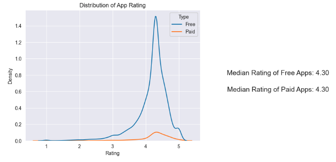

# Aiastan Sherniiazov Portfolio

Welcome to my world of data science, where curiosity meets innovation. My name is Aiastan Sherniiazov, and I am a driven data scientist with a solid foundation in Python, SQL, R, physics, and statistics. I have gained valuable experience through impactful internships where I applied machine learning techniques to drive business growth and used anomaly detection in battery cells. My passion lies in exploring complex data, extracting meaningful insights, and building predictive models that empower decision-making and drive business innovation. 

Here are some examples of my work during my free time:

# [Binary Classification with a Software Defects dataset](https://github.com/sherniia/Binary_classification_competition_kaggle)
This was the first Kaggle competition I have participated in. The challenge was to use binary classification on a software defects dataset. The competition provided an excellent learning curve for mastering machine learning algorithms, ensemble methods, and effective cross-validation techniques. Here are the key highlights:
* Utilized ensemble of algorithms to get an AUC Score of 0.79, which got me a 299 place out of 1702 teams (Top 20%)
* Final ensemble model consisted of:
  1. HistGradientBoostingClassifier
  2. LGBClassifier
  3. CatBoost
  4. ETClassifier
  5. XGB
  6. Logistic Regression with Kernel Approximation

 

# [Exploratory Data Analysis of Google Play Store Apps](https://github.com/sherniia/Google-Play-Store-App-EDA-Project)
I was interested in understanding the app market and what factors influence popularity of an app, as well as uncovering patterns and any trends, which potentially can be usefull for app developers. I used "Google Play Store Apps" dataset on Kaggle to do my exploratory analysis. Here some highlights:
* Tools Used: numpy, pandas, matplotlib.pyplot, seaborn.
* Numerical Findings:
  - **Reviews and Installs**: Apps with more reviews often have higher installs, reinforcing the importance of user feedback in app success.
- **Ratings and Installs**: A direct relationship between higher ratings and more installs suggests that app quality impacts popularity.
- **App Size**: Contrary to expectations, the app's size doesn't significantly influence its popularity.
- **Free vs. Paid**: Paid apps generally see fewer installs than their free counterparts.
* Categorical Insights:
  - **Ratings**: Apps in 'Art and Design', 'Comics', 'Health and Fitness', and 'Education' enjoy the highest median ratings, pointing to higher user satisfaction in these categories.
- **Reviews**: 'Entertainment' leads in terms of median reviews.
- **Size**: Games, being graphics-intensive, typically demand more storage.
- **Pricing**: 'Finance' apps come with a highest median price, possibly due to their specialized nature.
- **Installations**: Dominating categories in terms of installations include 'Weather', 'Education', 'Video players', 'Shopping', 'Photography', 'Game', and 'Entertainment'.

You can view the notebook with visuals [here](https://nbviewer.org/github/sherniia/Google-Play-Store-App-EDA-Project/blob/main/Google_apps_EDA_1.ipynb). 

#[Simulations of Binary Stars System](https://github.com/sherniia/Binary_Stars_Simulations)
I created a python model that simulates orbital motion of hypothetical binary star systems. I created six hypothetical binary star systems by using Newtonian mechanics, and assumed that orbital path is circular for simplicity. I was curious if it was possible to detect a planet orbiting around two stars using radial velocity method which is a method of finding exoplanets by looking at the wobbling motion of the star caused by the gravitational pull of planets orbiting around the star.

First, I had to create a program that calculates the velocity and acceleration of each object and then integrate it to get position and velocity. The calculated values were stored and plotted. I used R to animate some hypothetical systems.

The x-axis velocity of one of the stars in each system was used for spectral analysis. In theory, the gravitational pull of the planet would have an effect on star's velocity, allowing us to detect the signal via spectral analysis. However, I was not able to find any singificant signals, other than a signal from the second star. The mass of the second star is too big and overpowers any other gravitational signals. In order to detect an exoplanet, the exoplanet's mass has to be near the mass of the stars. Transit method seems to be a better method at detecting exoplanets around binary star systems.
*Tools used: pandas, numpy, scikit, R

Here are some animations:

