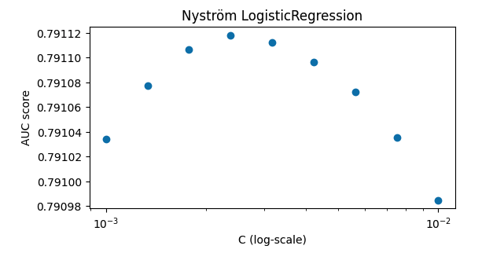

# Aiastan Sherniiazov Portfolio

Welcome to my world of data science, where curiosity meets innovation. My name is Aiastan Sherniiazov, and I am a driven data scientist with a solid foundation in Python, SQL, R, physics, and statistics. I have gained valuable experience through impactful internships where I applied machine learning techniques to drive business growth and used anomaly detection in battery cells. My passion lies in exploring complex data, extracting meaningful insights, and building predictive models that empower decision-making and drive business innovation. 

Here are some examples of my work during my free time:

# [Binary Classification with a Software Defects dataset](https://github.com/sherniia/Binary_classification_competition_kaggle)
* Utilized ensemble of algorithms to get an AUC Score of 0.79, which got me a 299 place out of 1702 teams (Top 20%)
* Final ensemble model consisted of:
  1. HistGradientBoostingClassifier
  2. LGBClassifier
  3. CatBoost
  4. ETClassifier
  5. XGB
  6. Logistic Regression with Kernel Approximation

 

# [Exploratory Data Analysis of Google Play Store Apps](https://github.com/sherniia/Google-Play-Store-App-EDA-Project)

